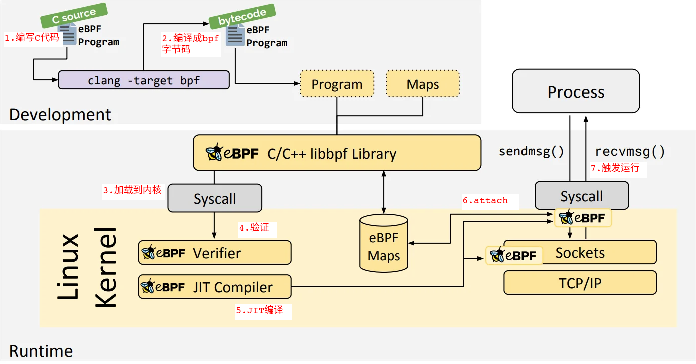

# eBPF基础

[toc]

### eBPF是什么？

eBPF 是可以在内核虚拟机中运行的程序，可以在不重启内核，不加载内核模块的情况下动态安全的扩展内核功能；

BPF 和 eBPF 的区别：

BPF :

```tex
是 Berkeley Packet Filter（伯克利包过滤）的简写；
BPF一般也叫做：cBPF (classic BPF)；
BPF允许用户空间程序链接到任何的网络套接字上，根据流过网络套接字的数据的类型进行过滤筛选；
网络抓包工具：tcpdump 或者 wireshark 就是BPF的经典应用案例；
```


eBPF: [e]xtended BPF

```
eBPF 在 BPF 的基础上进行改进增强：
1. 使用的寄存器个数从2个增加到10个
2. 寄存器从32bit扩展到64bit
3. 512 字节堆栈，无限制大小的 “map” 存储
4. 其它
```

​	

### eBPF有什么用？

主要用在：网络，安全，可视化；

简单的应用可以查看下开源代码： bpf-developer-tutorial 的 sample 程序描述


### eBPF的数据流？

以 libbpf 为例：



eBPF 数据流：

1. 用C语言编写 eBPF 的代码；
2. 用clang编译器把 C语言代码 编译成 eBPF 字节码；
3. 通过 bpf 的 syscall 系统调用，把eBPF字节码加载到内核；
4. 内核对eBPF字节码进行安全校验；是否有内存越界风险，复杂度是否过高，是否会进入死循环等；
5. 内核对eBPF字节码即时编译成本地机器码；
6. 把eBPF程序attach到挂接点，比如:  system calls, function entry/exit, kernel tracepoints, network events, 等；
7. 挂接点上的eBPF程序被触发运行； eBPF 程序都是被动触发运行的；


1. C语言编写的eBPF代码(这个示例代码是在 `libbpf-bootstrap` 框架下开发的):

```c
#include "vmlinux.h" //需要内核支持BTF
#include <bpf/bpf_helpers.h>
#include <bpf/bpf_tracing.h>

// eBPF代码功能：只要应用层打开文件，就会打印文件名
// 这个eBPF程序要运行在内核态
// 这个eBPF程序有2个section

// 第1个 section: 指定 license，如果没有指定，内核拒绝加载这个eBPF程序
char LICENSE[] SEC("license") = "Dual BSD/GPL";

// 第2个 section: 在 do_sys_open 内核接口的入口处放置一个kprobe探测点
// 只要打开文件，就会触发这个eBPF程序，并且打印这个文件名
SEC("kprobe/do_sys_open")
int BPF_KPROBE(do_sys_open, int dfd, const char *filename)
{
	bpf_printk("do_sys_open: name=%s\n", filename);

	return 0;
}
```


2. 用clang编译器把 C语言代码 编译成 eBPF 字节码；字节码用elf格式存储；

   2.1 编译：

   `clang -O2 -target bpf -c hello.bpf.c -o hello.bpf.o`

   

   2.2 查看elf中的Section Headers:

   `llvm-readelf -S hello.bpf.o `

   ```tex
   There are 13 section headers, starting at offset 0x670:
   
   Section Headers:
     [Nr] Name              Type            Address          Off    Size   ES Flg Lk Inf Al
     [ 0]                   NULL            0000000000000000 000000 000000 00      0   0  0
     [ 1] .strtab           STRTAB          0000000000000000 0005eb 000082 00      0   0  1
     [ 2] .text             PROGBITS        0000000000000000 000040 000000 00  AX  0   0  4
     [ 3] kprobe/do_sys_open PROGBITS       0000000000000000 000040 000038 00  AX  0   0  8
     [ 4] .relkprobe/do_sys_open REL        0000000000000000 000568 000010 10   I 12   3  8
     [ 5] license           PROGBITS        0000000000000000 000078 00000d 00  WA  0   0  1
     [ 6] .rodata           PROGBITS        0000000000000000 000085 000016 00   A  0   0  1
     [ 7] .BTF              PROGBITS        0000000000000000 00009c 0003af 00      0   0  4
     [ 8] .rel.BTF          REL             0000000000000000 000578 000020 10   I 12   7  8
     [ 9] .BTF.ext          PROGBITS        0000000000000000 00044c 00008c 00      0   0  4
     [10] .rel.BTF.ext      REL             0000000000000000 000598 000050 10   I 12   9  8
     [11] .llvm_addrsig     LLVM_ADDRSIG    0000000000000000 0005e8 000003 00   E  0   0  1
     [12] .symtab           SYMTAB          0000000000000000 0004d8 000090 18      1   4  8
   Key to Flags:
     W (write), A (alloc), X (execute), M (merge), S (strings), I (info),
     L (link order), O (extra OS processing required), G (group), T (TLS),
     C (compressed), x (unknown), o (OS specific), E (exclude),
     R (retain), p (processor specific)
   
   ```

   

   2.3 查看clang编译得到eBPF字节码：

   `llvm-objdump -d hello.bpf.o`

   ```tex
   .output/hello.bpf.o:	file format elf64-bpf
   
   Disassembly of section kprobe/do_sys_open:
   
   0000000000000000 <do_sys_open>:
          0:	79 13 68 00 00 00 00 00	r3 = *(u64 *)(r1 + 0x68)
          1:	18 01 00 00 00 00 00 00 00 00 00 00 00 00 00 00	r1 = 0x0 ll
          3:	b7 02 00 00 16 00 00 00	r2 = 0x16
          4:	85 00 00 00 06 00 00 00	call 0x6
          5:	b7 00 00 00 00 00 00 00	r0 = 0x0
          6:	95 00 00 00 00 00 00 00	exit
   
   ///////////////////////////////////////////////////////////////////////////////
   call 0x6: 
   	表示调用 在 bpf_helper_defs.h 文件中定义的 bpf_trace_printk 枚举值对应的内核接口
   	这个内核接口是在内核代码中的 linux-5.4.150/kernel/trace/bpf_trace.c 文件中定义：
   	bpf_trace_printk_proto
   r0 = 0x0:
   	表示把返回值存入 r0 寄存器
   ```

    

3. 通过 bpf 的 syscall 系统调用，把eBPF字节码加载到内核；

```c
// libbpf-bootstrap/libbpf/src/bpf.c
static inline int sys_bpf(enum bpf_cmd cmd, union bpf_attr *attr,
			  unsigned int size)
{
	return syscall(__NR_bpf, cmd, attr, size);
}

static inline int sys_bpf_fd(enum bpf_cmd cmd, union bpf_attr *attr,
			     unsigned int size)
{
	int fd;

	fd = sys_bpf(cmd, attr, size);
	return ensure_good_fd(fd);
}

int sys_bpf_prog_load(union bpf_attr *attr, unsigned int size, int attempts)
{
	int fd;

	do {
		fd = sys_bpf_fd(BPF_PROG_LOAD, attr, size);
	} while (fd < 0 && errno == EAGAIN && --attempts > 0);

	return fd;
}
```


4. 内核对eBPF字节码进行安全校验；

​	clang 编译通过，并不表示内核就可以检查通过；

```c
SEC("kprobe/vfs_write")
int BPF_KPROBE(vfs_write, struct file *file, const char *buf, size_t count, loff_t *pos)
{
	char dst_buf[256];
    
    /* 把 vfs_write 接口中的 buf 参数中的数据 读到 dst_buf 数组中，读取的数据长度为 count；
     * count 是个变量，运行过程中，可能会大于 dst_buf 数组长度，会导致数组越界，可能会导致内核崩溃；
     * 这样的eBPF代码，内核是拒绝执行的；
     * 如果把count改成常量，比如256，这样就确定不会数组越界，就可以通过内核检查；
     */
	bpf_probe_read_user(dst_buf, count, buf);

	return 0;
}
```


5. 内核对eBPF字节码进行JIT编译成本地机器码

```shell
# 以下命令可以查看加载到内核中的eBPF字节码
# 打印内核运行中的eBPF id
sudo bpftool prog show

# 打印 id = 53 的eBPF程序的汇编指令
sudo bpftool prog dump xlated id 53
sudo bpftool prog dump xlated id 53 opcodes # 增加 opcode(字节码) 的打印

# JIT 编译成本地机器码，暂时还没办法看到
```


6. 把eBPF程序attach到 `do_sys_open`

7. 挂接点上的eBPF程序被触发运行

   观察下 eBPF 程序的输出结果；

   

maps的作用：

​	负责内核层和应用层之间的数据交互，比如：

​		应用层通过map获取内核层eBPF程序收集到的数据；

​		应用层把参数通过map传递给内核层的eBPF程序；

```c
#include "vmlinux.h" //需要内核支持BTF
#include <bpf/bpf_helpers.h>
#include <bpf/bpf_tracing.h>

// 现在的eBPF程序，不管什么进程打开文件，都会打印文件名称出来，
// 如果只打印用户指定进程ID打开的文件名称，要怎么做？
//   用户态程序通过map，把指定的进程ID传给内核态的eBPF程序
//   如果调用 do_sys_open 接口的当前进程ID不等于用户指定的进程ID，就不输出打印，否则打印；

// 定义1个数组类型的map,数组长度为1，key 为数组下标，value是用户指定的PID(进程ID)
struct {
	__uint(type, BPF_MAP_TYPE_ARRAY);
	__uint(max_entries, 1);
	__type(key, u32);       // array数组下标
	__type(value, pid_t);   // 用户指定的pid
} my_pid_map SEC(".maps");

char LICENSE[] SEC("license") = "Dual BSD/GPL";

SEC("kprobe/do_sys_open")
int BPF_KPROBE(do_sys_open, int dfd, const char *filename)
{
	u32 index = 0;
    
    // 获取调用 do_sys_open 内核接口的当前进程ID
	pid_t pid = bpf_get_current_pid_tgid() >> 32;
    
    // 查找数组下标为0的数组元素值，即应用层传下来的 PID
	pid_t *my_pid = bpf_map_lookup_elem(&my_pid_map, &index);

    // 如果当前进程ID不等于应用层指定的PID，就不打印
	if (!my_pid || *my_pid != pid)
		return 1;

	bpf_printk("do_sys_open: name=%s\n", filename);

	return 0;
}
```


eBPF map的类型介绍，使用场景，程序示例，请参考：

http://arthurchiao.art/blog/bpf-advanced-notes-1-zh/


### eBPF的开发框架有哪些？

​    eBPF程序开发过程涉及 内核态代码编写，用户态代码编写，编译，加载，应用层和内核层数据交互等，很多繁琐的事情就可以交给开发框架来处理；目前主要有：

bcc，bpftrace，libbpf-bootstrap，Go eBPF library

bcc 和 bpftrace   是：python语言库；

Go eBPF library  是：GO语言库；

libbpf-bootstrap 是：C语言库；

参考：

​	https://ebpf.io/what-is-ebpf/#development-toolchains

​	https://github.com/eunomia-bpf/bpf-developer-tutorial

​			bpf-developer-tutorial/src/0-introduce/README.md


### eBPF参考资料

基础概念：
	 Linux源码/Documentation/networking/filter.txt
	 https://ebpf.io/what-is-ebpf/

​    https://www.kernel.org/doc/html/latest/bpf/libbpf/index.html

开源代码:

​    libbpf-bootstrap：https://github.com/libbpf/libbpf-bootstrap

​    libbpf-bootstrap 中文介绍：https://blog.csdn.net/sinat_38816924/article/details/122259826

​    libbpf-bootstrap 英文原版介绍：https://nakryiko.com/posts/libbpf-bootstrap/


​    bpf-developer-tutorial： https://github.com/eunomia-bpf/bpf-developer-tutorial

​    bpf-developer-tutorial 的readme文档中有非常丰富的资源介绍；   

其它：

​	eBPF C编程:

​	https://www.bilibili.com/video/BV1f54y1h74r/?spm_id_from=333.999.0.0&vd_source=5c3a508420a1ab4902225c642abde096

​	ebpf工作原理浅析：

​	https://www.bilibili.com/video/BV1HW4y1674H/?spm_id_from=333.999.0.0&vd_source=5c3a508420a1ab4902225c642abde096

​    


