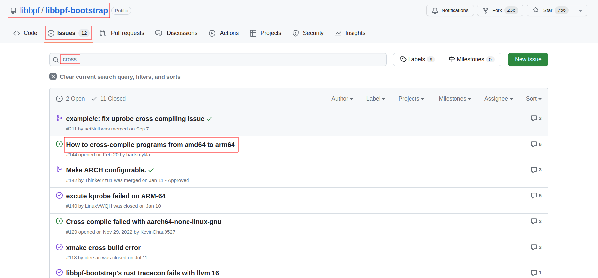

# libbpf-bootstrap交叉编译

[toc]

在嵌入式arm平台上开发产品时，经常遇到内存，性能的问题，可以用上ebpf这个功能强大的工具吗？

当然可以！

这节视频讲下 libbpf-bootstrap 在 arm32 平台上的交叉编译(arm64平台的交叉编译也类似)；


## 交叉编译方法

- 到 libbpf-bootstrap 开源仓库：

  https://github.com/libbpf/libbpf-bootstrap

  libbpf-bootstrap 的镜像仓库，访问速度比较快：

  https://hub.njuu.cf/libbpf/libbpf-bootstrap

  

  查找交叉编译的方法：

  在 libbpf-bootstrap github开源仓库页面，点击 Issues 选项，搜索框中输入 `cross` 搜索：

  [How to cross-compile programs from amd64 to arm64](https://github.com/libbpf/libbpf-bootstrap/issues/144)

  

  

  

  ```shell
  # 交叉编译命令示例：
  make EXTRA_CFLAGS="-IXXX" EXTRA_LDFLAGS="-LXXX" ARCH=arm64
  # 或者：
  make EXTRA_CFLAGS="-IXXX" EXTRA_LDFLAGS="-LXXX" ARCH=arm
  ```

​	

`EXTRA_CFLAGS` 和 `EXTRA_LDFLAGS` 有什么用？

阅读下 libbpf-bootstrap 开源代码中的 `README.md` 文档，在 `Install Dependencies` 章节中的描述：

```
You will need clang (at least v11 or later), libelf and zlib to build 
the examples, package names may vary across distros.
```

即libbpf-bootstrap需要依赖: `libelf` 和 `zlib`

所以，交叉编译时需要：

 `EXTRA_CFLAGS`   指定 `libelf` 和 `zlib` 的头文件路径；

 `EXTRA_LDFLAGS` 指定 `libelf` 和 `zlib` 的库文件路径；


## 确定是否需要交叉编译 `libelf` 和 `zlib`

如果交叉编译工具链已经有 libelf 和 zlib，就不需要交叉编译这2个库；

```shell
cd /your/toolchain/
find . -name libelf.*
find . -name libz.*
```


## 交叉编译 `zlib`

zlib源码下载：http://www.zlib.net/

```shell
tar -axf zlib-1.3.tar.gz
cd zlib-1.3
export PATH=$PATH:/home/xxx/Desktop/imx6ull_dev/sdk/ToolChain/arm-buildroot-linux-gnueabihf_sdk-buildroot/bin
export CC=arm-buildroot-linux-gnueabihf-gcc
./configure --prefix=$PWD/_install
make
make install
# 当前目录下的_install，就是编译出来的头文件和lib库
```


## 交叉编译 `libelf`

elfutils源码下载：https://sourceware.org/elfutils/

[elfutils-latest.tar.bz2](https://sourceware.org/elfutils/ftp/elfutils-latest.tar.bz2)

```shell
tar -axf elfutils-latest.tar.bz2
cd elfutils-0.189
# 参考当前目录下的 INSTALL 文档 和 网上资料
./configure --prefix=$PWD/_install --build=x86_64-linux-gnu \
	--host=arm-buildroot-linux-gnueabihf \
    CC=arm-buildroot-linux-gnueabihf-gcc CXX=arm-buildroot-linux-gnueabihf-g++ \
    --disable-nls --disable-rpath --disable-libdebuginfod --disable-debuginfod \
    --with-zlib
make
make install

# 当前目录下的_install，就是编译出来的头文件和lib库
```


## 交叉编译 `libbpf-bootstrap`

如果系统自带的 clang 编译器版本过低，

编译之前需要先修改： `libbpf-bootstrap/examples/c/Makefile` 文件，指定 clang 编译器：

```makefile
CLANG ?= clang
# 改为:
CLANG ?= /your-clang-version/clang  # your-clang-version 指的是自己下载的clang版本
```

交叉编译命令：

```shell
# export 交叉编译工具链的路径
export PATH=$PATH:/home/xxx/Desktop/imx6ull_dev/sdk/ToolChain/arm-buildroot-linux-gnueabihf_sdk-buildroot/bin

# 编译选项中增加 V=1, 打印详细的编译命令
# make EXTRA_CFLAGS="-IXXX" EXTRA_LDFLAGS="-LXXX" ARCH=arm
make ARCH=arm \
	EXTRA_CFLAGS="-I/home/xxx/Desktop/ebpf/note/src/arm32/extra_libs/zlib-1.3/_install/include -I/home/xxx/Desktop/ebpf/note/src/arm32/extra_libs/elfutils-0.189/_install/include" \
	EXTRA_LDFLAGS="-L/home/xxx/Desktop/ebpf/note/src/arm32/extra_libs/zlib-1.3/_install -L/home/xxx/Desktop/ebpf/note/src/arm32/extra_libs/elfutils-0.189/_install/lib" \
	minimal_legacy V=1
```

编译 libbpf 库时用的编译器是 `cc `，而不是交叉编译器 `arm-buildroot-linux-gnueabihf-gcc`

查看下 `libbpf-bootstrap/examples/c/Makefile` 文件中的 `CC` 变量相关的定义：

```makefile
$(call allow-override,CC,$(CROSS_COMPILE)cc)
$(call allow-override,LD,$(CROSS_COMPILE)ld)
```

需要 `CROSS_COMPILE` 变量的定义，才会把 `CC` 替换成交叉编译工具链，把交叉编译命令改为：

```shell
# export 交叉编译工具链的路径
export PATH=$PATH:/home/xxx/Desktop/imx6ull_dev/sdk/ToolChain/arm-buildroot-linux-gnueabihf_sdk-buildroot/bin

make ARCH=arm CROSS_COMPILE=arm-buildroot-linux-gnueabihf- \
	EXTRA_CFLAGS="-I/home/xxx/Desktop/ebpf/note/src/arm32/extra_libs/zlib-1.3/_install/include -I/home/xxx/Desktop/ebpf/note/src/arm32/extra_libs/elfutils-0.189/_install/include" \
	EXTRA_LDFLAGS="-L/home/xxx/Desktop/ebpf/note/src/arm32/extra_libs/zlib-1.3/_install -L/home/xxx/Desktop/ebpf/note/src/arm32/extra_libs/elfutils-0.189/_install/lib" \
	minimal_legacy V=1
```

为了编译方便，可以写一个shell脚本配置编译环境：

`build_env.sh`

```shell
#！/bin/sh
export PATH=$PATH:/home/xxx/Desktop/imx6ull_dev/sdk/ToolChain/arm-buildroot-linux-gnueabihf_sdk-buildroot/bin
export ARCH=arm
export CROSS_COMPILE=arm-buildroot-linux-gnueabihf-
export EXTRA_CFLAGS="-I/home/xxx/Desktop/ebpf/note/src/arm32/extra_libs/elfutils-0.189/_install/include -I/home/xxx/Desktop/ebpf/note/src/arm32/extra_libs/zlib-1.3/_install/include"
export EXTRA_LDFLAGS="-L/home/xxx/Desktop/ebpf/note/src/arm32/extra_libs/elfutils-0.189/_install/lib -L/home/xxx/Desktop/ebpf/note/src/arm32/extra_libs/zlib-1.3/_install/lib"
```

交叉编译时先执行一次: `source build_env.sh`

之后就可以简单执行：`make clean; make minimal_legacy`


## eBPF 内核配置选项

Linux内核版本：4.9.88

要让ebpf跑起来，还需要内核的支持，需要打开如下的内核配置选项：

```shell
[*] Networking support  --->
      Networking options  --->
            [*] enable BPF Just In Time compiler
            [*] QoS and/or fair queueing  --->
            	  <*>   BPF-based classifier
                  [*]   Actions
            	        <*>     BPF based action

General setup  --->
      [*] Enable bpf() system call
      [*] Kprobes

Kernel hacking  --->
      [*] Tracers  --->
      		[*]   Enable kprobes-based dynamic events (NEW)
            [*]   Enable uprobes-based dynamic events
```


arm32开发板上，`minimal_legacy` 跑不起来:

这个地方我调试了好久，好像这个版本的内核不支持ebpf 的 tracepoint/syscalls，不知道是不是我哪里搞错了，

先不管了，改成kprobe试一试，实现的功能是一样的；

```c
SEC("tp/syscalls/sys_enter_write")
int handle_tp(void *ctx)
//改为：
SEC("kprobe/sys_write")
int BPF_KPROBE(sys_write)
```

