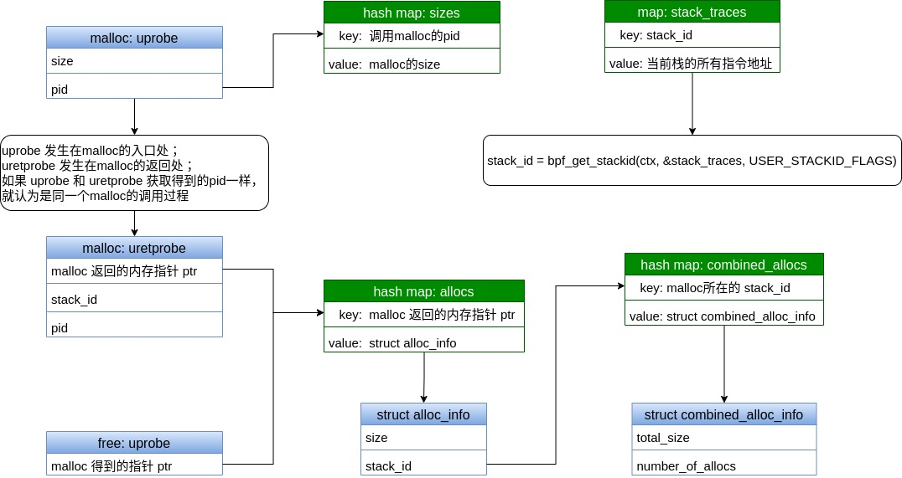

# eBPF 内存泄露检测原理

[toc]

## 内存泄露检测的任务

```c
#include <stdio.h>
#include <stdlib.h>
#include <string.h>
#include <unistd.h>

static void * alloc_v3(int alloc_size)
{
    void * ptr = malloc(alloc_size);
    
    return ptr;
}

static void * alloc_v2(int alloc_size)
{
    void * ptr = alloc_v3(alloc_size);

    return ptr;
}

static void * alloc_v1(int alloc_size)
{
    void * ptr = alloc_v2(alloc_size);

    return ptr;
}

int main(int argc, char * argv[])
{
    const int alloc_size = 4;
    void * ptr = NULL;
    int i = 0;

    for (i = 0; ; i++)
    {
        ptr = alloc_v1(alloc_size);

        sleep(2);

        if (0 == i % 2)
        {
            free(ptr);
        }
    }

    return 0;
}
```


内存泄露检测的任务，需要输出下面的报告：

```
stack_id=0x3f3 with outstanding allocations: total_size=12  nr_alloc=3
  0 [<0000555b65a096f2>] alloc_v3+0x18 test_memleak.c:8
  1 [<0000555b65a09711>] alloc_v2+0x15 test_memleak.c:15
  2 [<0000555b65a09730>] alloc_v1+0x15 test_memleak.c:22
  3 [<0000555b65a09770>] main+0x36 test_memleak.c:35
  4 [<00007fe8c8a7bc87>] __libc_start_main+0xe7
  5 [<05f6258d4c544155>]
```

报告的内容包含下面3个信息：

1. 定位到内存泄露的代码段：函数名，文件名，行号；
2. 泄露的内存总大小；
3. 内存泄露的次数；


## ebpf如何获取用户态堆栈？

ebpf获取到的堆栈示例：一组指令地址的数组

```
//stack_id=0x3f3
[0000555b65a096f2,
 0000555b65a09711,
 0000555b65a09730,
 0000555b65a09770,
 00007fe8c8a7bc87,
 05f6258d4c544155]
```

第1种方法：获取堆栈和stack_id

```c
////// 内核态的ebpf
long bpf_get_stackid(void *ctx, void *map, __u64 flags);

/* stack_traces 是 BPF_MAP_TYPE_STACK_TRACE 类型的 maps
 * flags = 0 | BPF_F_FAST_STACK_CMP 表示获取内核态的堆栈
 * flags = 0 | BPF_F_FAST_STACK_CMP | BPF_F_USER_STACK 表示获取用户态的堆栈
 */
stack_id = bpf_get_stackid(ctx, &stack_traces, 0 | BPF_F_FAST_STACK_CMP | BPF_F_USER_STACK);

////// 用户态的ebpf
/* 通过 bpf_map__lookup_elem 接口在 stack_traces maps中查找 stack_id 对应的 完整堆栈信息
 * stack_traces 是内核态ebpf代码中定义的maps
 * stack_id 是内核态ebpf通过 bpf_get_stackid 接口获取到的堆栈ID
 * stack_key_size 是stack_traces这个maps的key类型大小
 * out_stacks_arry 是用来存储 stack_id 对应的完整调用栈（一组指令地址）
 * out_stacks_arry_size 是 out_stacks_arry 的数组长度
 */
bpf_map__lookup_elem(skel->maps.stack_traces, \
                     &stack_id, stack_key_size, \
                     out_stacks_arry, out_stacks_arry_size, 0);

```

第2种方法： 只获取堆栈，不计算 stack_id

```c
//参考：libbpf-bootstrap/examples/c/profile.bpf.c
long bpf_get_stack(void *ctx, void *buf, __u32 size, __u64 flags);
```


BPF_MAP_TYPE_STACK_TRACE 的解释：
http://arthurchiao.art/blog/bpf-advanced-notes-2-zh/#1-bpf_map_type_stack_trace

```
内核程序能通过 bpf_get_stackid() helper 存储 stack 信息。 
将 stack 信息关联到一个 id，而这个 id 是对当前栈的 
指令指针地址（instruction pointer address）进行 32-bit hash 得到的。
```


## 内存泄露检测原理

以 malloc 和 free 为例：

```c
void *malloc(size_t size);
void free(void *ptr);
```

从 malloc 调用中可以提取到3个关键信息：

- malloc 的内存大小 size （通过 uprobe 获取）
- malloc 返回的内存指针 ptr （通过 uretprobe 获取）
- 执行到 malloc 的 stack_id（在 uretprobe 中通过 bpf_get_stackid 接口获取）


从 free 调用中可以提取最关注的1个信息：

- free 释放的内存指针 ptr（通过 uprobe 获取）


基本思路：

在每一个 malloc 调用的地方都记录一个统计信息，包括分配的内存总大小 和 分配次数

(如果代码中有2个不同地方调用malloc，就会有2个不同的统计信息)

- 如果 malloc 成功，更新统计信息：增加内存总大小，分配次数加1
- 如果 free 成功，更新统计信息：减少内存总大小，分配次数减1

最后通过遍历每一个malloc调用地方记录的统计信息，如果内存总大小或者分配次数不是0，就是有内存泄露！

```c
static void * foo(int alloc_size)
{
    /* 1. alloc_size
     * 2. ptr
     * 3. 调用到这的 stack_id1
     * 统计信息1: 每一个malloc都对应1个stack_id, 每一个stack_id都对应1个统计信息
     */
    void * ptr = malloc(alloc_size);

    return ptr;
}

static void * bar(int alloc_size)
{
    /* 1. alloc_size
     * 2. ptr
     * 3. 调用到这的 stack_id2
     * 统计信息2: 每一个malloc都对应1个stack_id, 每一个stack_id都对应1个统计信息
     */
    void * ptr = malloc(alloc_size);

    return ptr;
}

int main(int argc, char * argv[])
{
    void * p1 = foo(4);
    void * p2 = bar(8);
    
    // 释放的内存指针 p1
    free(p1);

    return 0;
}
```

```bash
ldd memleak_test		# 查看该程序使用的libc库的路径
```


结构体和maps示例图：




